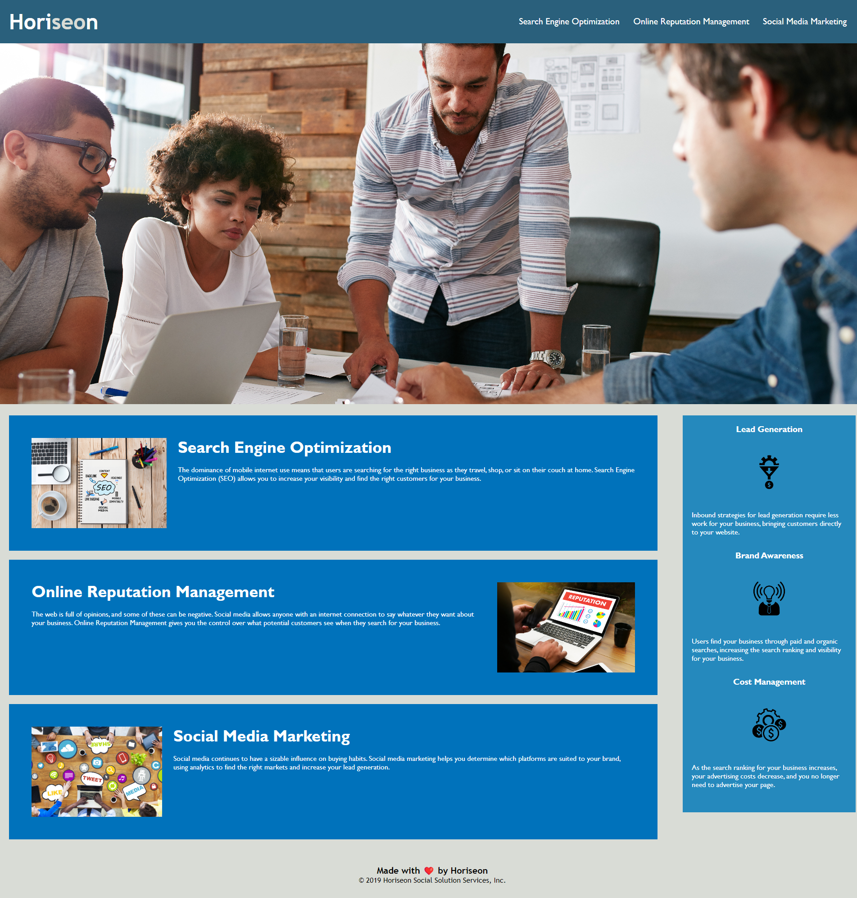

#  Horiseon Refactor Assignment Week 1

##  Project Description

The Horiseon Social Solution services page features a large hero banner, three main sections and a sidebar. The page has a navigational header and a footer featuring copyright info. Semantic html and image alt descriptions were added to increase search engine optimization an accessibility.

### Contents

1. [Deployed Page](#deployed-page)
2. [Refactor Comments](#refactor-comments)
3. [Contributions](#contributions)
4. [Reference](#reference)

### Deployed Page
[Deployed Website via Github Pages](https://neuroventure.github.io/02-Challenge/)

### Refactor Comments 

* Added comments to the index.html and the style.css to show refactoring
* Replaced many div elements with semantic HTML and .CSS elements to improve search placement.
* Removed unnecessary class attributes.
* Fixed a broken navigational link.
* Added a proper website title.
* Added alt attributes to images for improved accessibility.
* Fixed a broken link in the nav bar.

### Contributions

* Refactoring was completed by Sean Keller
* Web Page provided by [UofO Boot Camp](https://bootcamp.uoregon.edu/)

### Reference

I used the following resources to help complete the Refactoring
+ [MDN Web Docs](https://developer.mozilla.org/en-US/)
+ [W3 Schools](https://www.w3schools.com/)
+ [Chat GPT](https://chat.openai.com/)
+ [Google](google.com)

